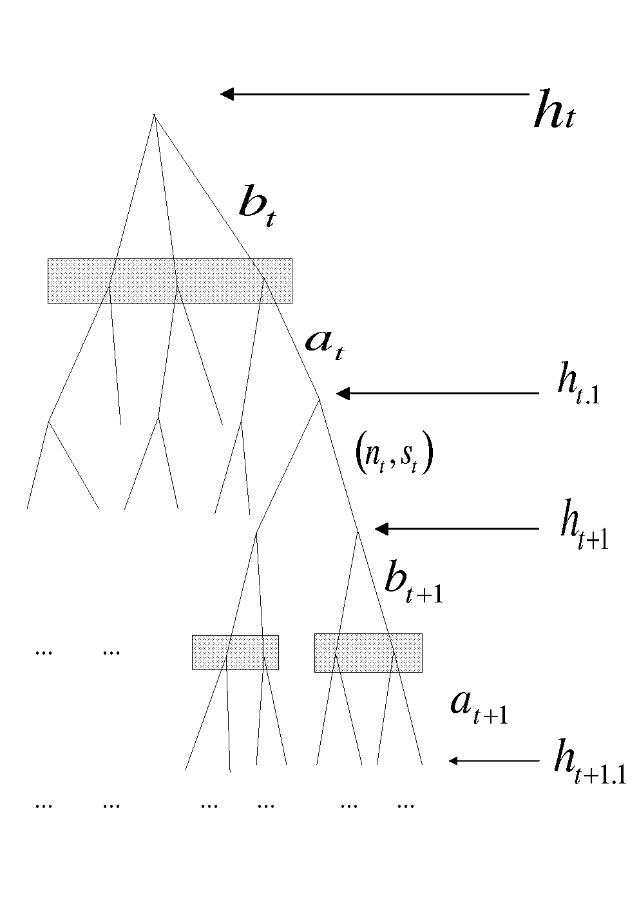

```{r setup, include=FALSE, cache=TRUE}
library(bookdown)
knitr::opts_chunk$set(echo = TRUE)
```


####  Abstract {-} 

The article describes the typical features of a Latex document that this package can convert to the Rmarkdown format. The converted markdown document, possibly after further addition of other R chunks and edits, can be converted to html and word documents using R package knitr. It is also possible to convert it back to Latex, but you may have to tweak it a little to make the latex output look nice. 

**Keywords:** Latex, html, Rmarkdown, Microsoft word. 

**Acknowledgement and disclaimer**^[
Many thanks for comments.
]


# Introduction {#sec1}
This article uses bits and pieces of Latex contents from my own papers to illustrate features of this package. It is important to *emphasize* in **bold text that NOT ALL** features involving complex formatting codes in the Latex can be converted. It will convert only those that it is able to convert and the rest will be left alone. It incorporates basic minimum features generally used in a Ph.D. thesis, scientific article or a book. See this footnote^[It does not convert latex tables completely. This version of the software only creates a template for table with caption and label, you need to fill in the details in R markdown document.] for limitations on converting Latex table environment.

Section \@ref(sec2) describes how to get the software and use it. It runs under 32bit or 64bit windows 7, 8, 10 and 64bit Linux operating system. I programmed it in C++ and Java. In future, I will develop an R package that can combine knitr step to produce directly html file.  The steps are simplified to minimum of just downloading an exec file meant for your operating system and running it on your Latex file. The rest of the article describes various features of Latex document, it can convert. 
 
Section \@ref(sec3) discusses how it converts references. Section \@ref(sec4) shows what kind of equations both displayed and inline are converted. Pretty much it converts all math formats. Section \@ref(sec5) shows conversions of figures and tables. Section \@ref(sec6) describes the list like environments such as itemize, enumerate and description. These environments may be present inside other environments such as in propositions, theorems, lemmas, conjectures, proofs, remarks etc, as shown in Section \@ref(sec7). Conversions of list environments are not perfect, you may need some tweaking in the converted Rmarkdown document. Section \@ref(sec7) shows theorem like Latex environments such as Theorem, Lemma, Proposition each with its own auto numbering, and proof like environments without numbering. Section \@ref(sec8) discusses a few important facts and how to remark.

# Installation and Running {#sec2}
The software runs on 32bit and 64bit windows and 64bit Linux operating systems.  Just download the exec file for your operating system and run it. You can find the exec files here [https://github.com/lakshmiraut/Tex2Rmd/releases/tag/V0.1](https://github.com/lakshmiraut/Tex2Rmd/releases/tag/V0.1). In this directory, you can also find a pdf file Temp1.pdf created using xelatex on the source file Temp1.tex, and also the R markdown, html and word files created by this program (creating Rmd file) and knitr in R or Rstudio (creating html and docx files).

Easiest way to start is to run the exec file by typing tex2rmd. It will show it's usage as below:

usage: tex2rmd inputTexFileName.tex -b bibFile.bib -o outputRmdFileName.Rmd 

where inputTexFileName.tex is the name of the source tex file. The rest are optional. If you did not provide the rest, it will not use any bibliography file (which you can add later) and also it will save the Rmd file in the source text directory with the same file name appending "-converted" and with file extension Rmd.  

-b bibFile.bib means user provides a bibliography file, which in this example is named bibFile.  It can use only bibliography files in bibTex format. This you specify if you have references in your document.

-o outputRmdFileName.Rmd means user provides a name the the R markdown file. If it is not provided, then the program will create a file in the same directory with the same source filename with -converted appended with extension Rmd in the same directory as the source file.

Next step:You can edit and add R markdown chunks and then use knitr to convert the Rmd file to html or word document.  

As an example, I used Example1.tex and bibFile1.bib, and ran  

tex2rmd Example1.tex -b bibFile1.bib  

creates Example1-converted.Rmd. You can download those files to a directory of your choice and ran the above command.  If you want to convert this Rmd file to other formats, you also need to download any other files it refers to, in this case tree1.png file. I then use knitr on the file Example1-converted.Rmd to create html file Example1-converted.html. You can also create word document using the appropriate yml commands on the top of the Rmd file. 

# Referencing {#sec3}
The program converts pretty much all formats of citation.  For instance, the text with citations as given below converts perfectly.

The main findings in [@Aalen.etal_2008_Book;@Kanherkar.etal_2014] are that .... For the effects of early childhood factors on school and labor market outcomes, see @Heckman.Raut_2016, and also see @Raut_2018 with an updated references. In machine learning, [@Altae-Tran_2016;@Altae-Tran.etal_2017] show how an RNN can be used with limited data. 

# Equations {#sec4}

Here is an eqnarray environment copied directly from the Latex source file of my paper, @Raut_2019. 

\begin{eqnarray}
\lambda _{hj}(t) &=&\lim_{\Delta t\rightarrow 0}\frac{P_{hj}(t,t+\Delta
t)-P_{hj}\left( t,t\right) }{\Delta t},\text{for }j\in S,\text{ which for }
j\neq h\text{ becomes}  \nonumber \\
&=&\lim_{\Delta t\rightarrow 0}\frac{P_{hj}(t,t+\Delta t)}{\Delta t},\text{
and for }j=h\text{ becomes}  \nonumber \\
\lambda _{hh}(t) &=&\lim_{\Delta t\rightarrow 0}\frac{P_{hh}(t,t+\Delta t)-1
}{\Delta t}  (\#eq:eq3) \\
&=&-\lim_{\Delta t\rightarrow 0}\frac{\sum_{j\neq h}P_{hj}(t,t+\Delta t)}{
\Delta t}  \nonumber \\
&=&-\sum_{j\neq h}\lambda _{hj}\left( t\right)   \nonumber
\end{eqnarray}

See section \@ref(sec7) for more equations.  You can have inline math such as $\int f(x) d\mu(x)$. Make sure there are trailing spaces of the text of this inline math equation, that sometimes do not convert properly.

# Figures and Tables {#sec5}

This is an example of converting a Latex figure with includegraphics in png format. It can be referred in the text using Figure \@ref(fig:fig1).
 
```{r, echo=FALSE,out.width ="50%", fig.align='center', label='fig1', fig.cap='Extensive form representation of the multi-stage game, $\\Gamma(h_t)$'}

```


The software can also convert Tikz pictures as well.  Here is one taken from my @Raut_2017a paper.

```{tikz, echo=FALSE, fig.align='center', fig.ext= 'png', label='fig2', fig.cap='Sets of individuals $(\\tau_t,s_{t-1})$ for whom $\\sigma(\\tau_t,s_{t-1})=s_t$ and $\\sigma(\\tau _t,s_{t-1})=s^{\\prime }_t$'}

\begin{center}
\begin{tikzpicture}[scale=0.5]
\draw[thick,<->] (0,10) node[left]{$\tau_t$}--(0,0)--(10,0) node[below]{$s_{t-1}$};
\node [below left] at (0,0) {$0$};
\draw(0.5,10) ..controls (1,5) and (3.5,2) .. (10,0.5) node[right]{$\sigma(\tau_t, s_{t-1})=s_t$};
\draw(1,10) ..controls (2,4.5) and (3,3.5) .. (10,1.2) node[right]{$\sigma(\tau_t, s_{t-1})=s'_t$};
\node [below left] at (6,6) {$s'_t > s_t$};
\end{tikzpicture}
\end{center}


```


The following table can be referenced like "Table \ref{table2}" or like "Table \@ref(tab:table2)". Both produce the same link as you can see.
<!-- ============================================================================== -->
```{r, echo=FALSE,warnings=FALSE, label='table2'}
table1 <- knitr::kable(data.frame('your data frame'),
	digits=3,
	caption='Steady-state local learning and subgame perfect gift equilibria for the economy with $\\delta _{0}=0.35$')
table1
```

<!-- ================================================================= -->

# List like environments: itemize, enumerate, description {#sec6}

Enumerate items


1. One 
1. Two 
1. Three 


Description items

 
  * Can  convert theorems and theorem like environments like proposition, lemma etc.

  * Can  convert proof environment. 
  
  * Can  convert assumption and remark environments: Assumption is user created environment, and remarks either as Latex environment or user created latex environment.
   
  * Figures:  Can convert includegraphics with png files and embedded Tikz figure environment. 
  
  * Tables:  It converts tables as a Rmarkdown table chunk keeping only the label and caption of the Latex tables. The references to the table is also converted throughout the document.  The content of a Latex table may involve complex structure and often created using excel or R and better left for various R packages to create those Rmarkdown table contents in the converted Rmarkdown document.
  
  * It  converts other Latex envirnments: quote,  and other Latex commands as  \\section, \\subsection, \\subsubsection,  \\emph, \\texbf \\url \\footnote.  This document contains all these, so you can compare the source file and converted file to see those.  For other examples, go to my publications page [https://lakshmiraut.github.io/publication/](https://lakshmiraut.github.io/publication/), click on the preprint button, or to my main page, [https://lakshmiraut.github.io](https://lakshmiraut.github.io).
  
 

# Theorem like environments {#sec7}
I illustrate the content of this section taking a section of my paper, @Raut_2017a. This involves definition, theorem and proof environments.  Similarly, it will convert other theorem and theorem like environments of your Latex document.
 
```{definition, label = 'def1'}

 Initial distribution $\pi ^{0}$ of social groups in $\mathcal{S}$, is given. A **signaling equilibrium**\index{Signaling equilibrium} is a sequence of probability distributions $\left\{ q_{t}\left( e_{t}|s_{t}\right) \right\} _{1}^{\infty }$ and a sequence of optimal schooling decision rules $\left\{ \sigma _{t}\left( \tau _{t},s_{t-1}\right) \right\} _{1}^{\infty }$ such that at each period $t\geq 1,$


1. The  induced wage schedule $w_{t}\left( s_t\right) =\int e_{t}q_{t}\left(
e_{t}|s_{t}\right)  de_{t}$ is a smooth concave function.

1. Given  $w_{t}\left( s_t\right)$, the function $\sigma _{t}\left(\tau
_{t},s_{t-1}\right)$ solves the schooling decision problem of each
agent $\left( \tau _{t},s_{t-1}\right)$.

1. The  induced  conditional distribution $\hat{q}_{t}\left( e_{t}|s_{t}\right)$ of $e_{t}$ given the optimal solution 
$s_{t}=\sigma _{t}\left( \tau _{t},s_{t-1}\right)$ obtained by using Bayes
rule coincides with the anticipated conditional distribution $q_{t}\left(
e_{t}|s_{t}\right)$ for all $s_{t}$.

```


I assume the following:

(ref:A1) A1

```{block2,echo = TRUE, type='assumption'}
**Assumption (ref:A1):** 
$\theta _{t}(s_{t},\tau _{t},s_{t-1})$ $=\theta _{1}\left( s_{t}\right) \cdot \theta _{2}\left( \tau _{t}\right) \cdot \theta _{3}\left( s_{t-1}\right) ,$ $\theta _{1}\left( {}\right)$ is smooth, monotonically increasing and concave, $\theta _{2}\left( {}\right)$ and $\theta _{3}\left( .\right)$ are smooth, monotonically decreasing.

```


(ref:A2) A2

```{block2,echo = TRUE, type='assumption'}
**Assumption (ref:A2):** 
The distributions $g\left( \tau \right)$ and $\pi _{0}\left( s_{0}\right)$ belong to a concave conjugate family.

```


```{theorem}

Under Assumption (ref:A1) and Assumption (ref:A2), there exists a signaling equilibrium.
```


<br>
```{proof, type='Proof'}

Suppose we have found a smooth concave wage schedule $w_{t}\left( s\right)$
with a first derivative $w_{t}^{\prime }\left( {}\right)$. The first order
condition of the optimization problem is given by 

\begin{equation}
\frac{w_{t}^{\prime }\left( s_{t}\right) }{\theta _{1}^{\prime }\left(
s_{t}\right) }=\theta _{2}\left( \tau _{t}\right) \theta _{3}\left(
s_{t-1}\right)  \label{eq10}
\end{equation}

The rest is given in @Raut_2017a.


<div style="text-align:right;">$\blacksquare$</div>
```


# Remarks {#sec8}

Remarks are numbered and and can have labels which can used to refer to them in the text.


(ref:R1) R1

```{block2,echo = TRUE, type='rmark'}
**Remark (ref:R1):** 
The processing of Rmarkdown file is best done in Rstudio. It can also be done in R. You need to have the following R packages in R or Rstudio, issuing command: install.packages(c("knitr","rmarkdown","bookdown","reticulate","pdftools","magick")). Package reticulate is needed if you want to incorporate python codes in Rmarkdown document. Apart from R, you need to have a Latex document processing system such as Miktex for windows and Tex Live for Linux.  You also need pandoc which is automatically installed with RStudio installation, otherwise you need this package. You also need to pandoc's pandoc-crossref package that can work with your pandoc package.  

```


(ref:re10) R2

```{block2,echo = TRUE, type='rmark'}
**Remark (ref:re10):** 
This remark can be referred in the text. In the latex document using its convention. To see how it is to be done in Rmarkdown, see the converted Rmarkdown document and the text below it.

```


The bibliography also can be converted. 

# References {-}
<div id="refs"></div>
